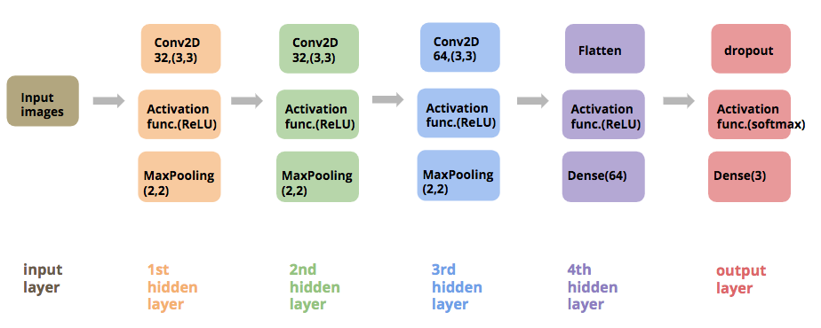
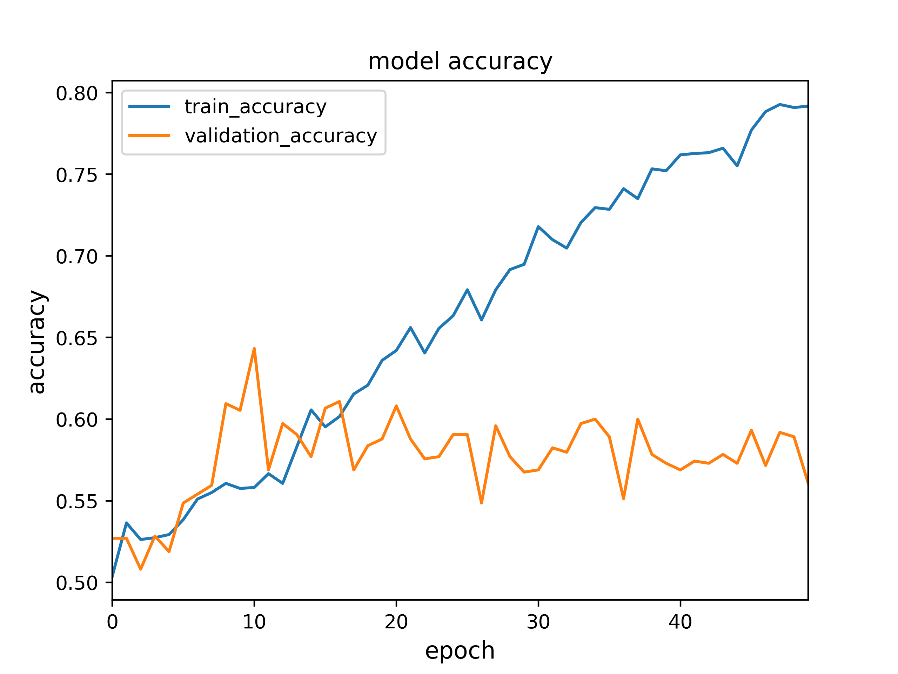
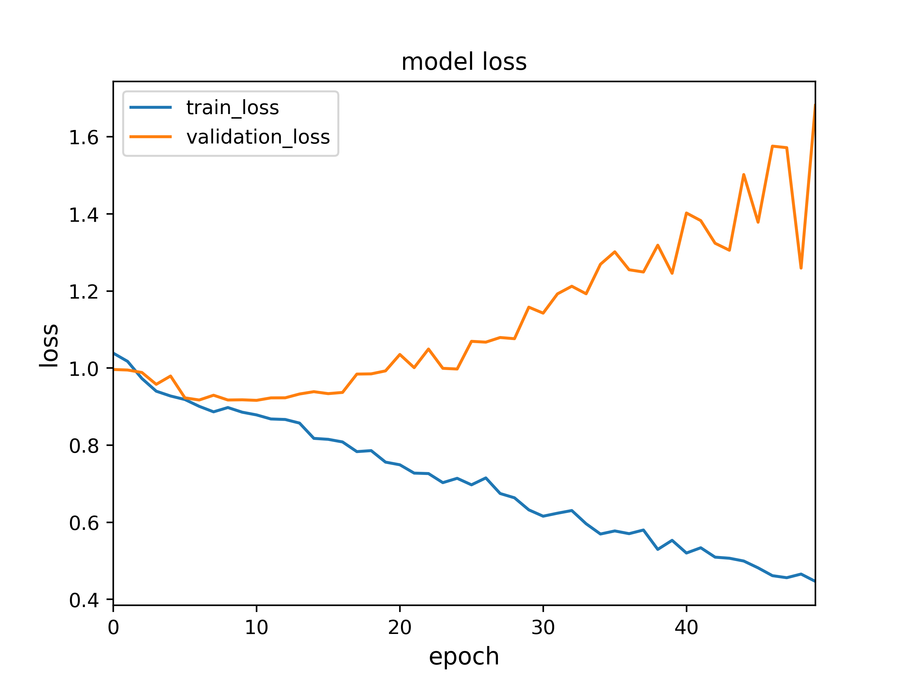
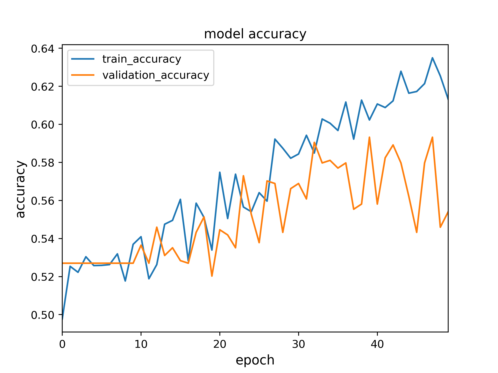
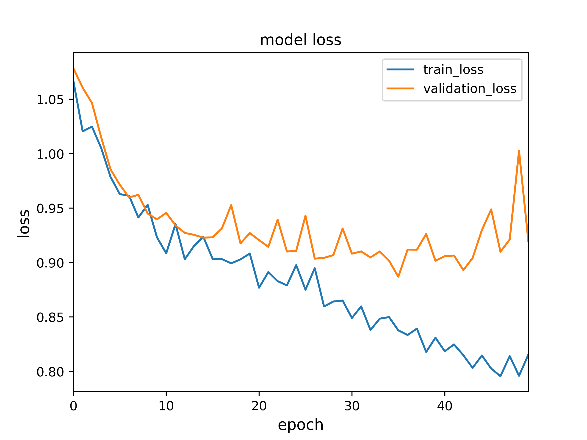
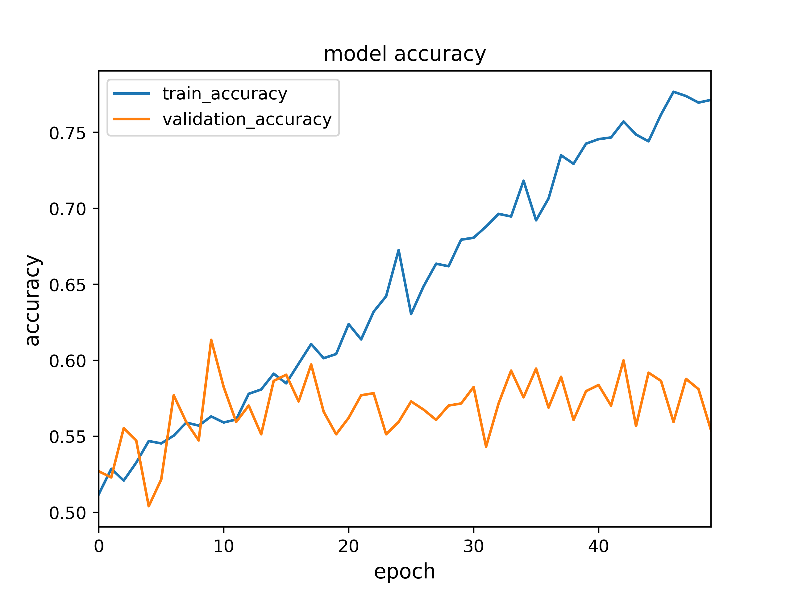
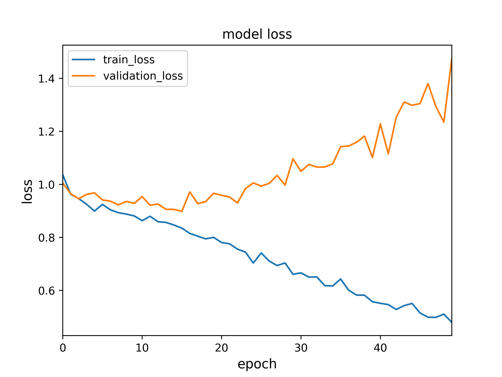
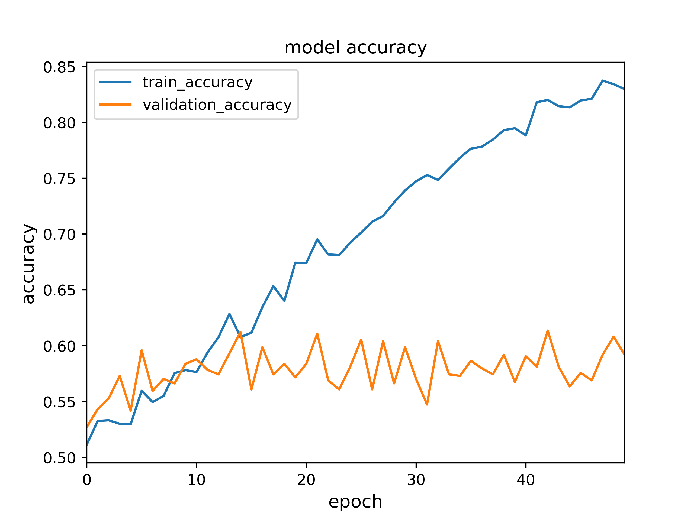
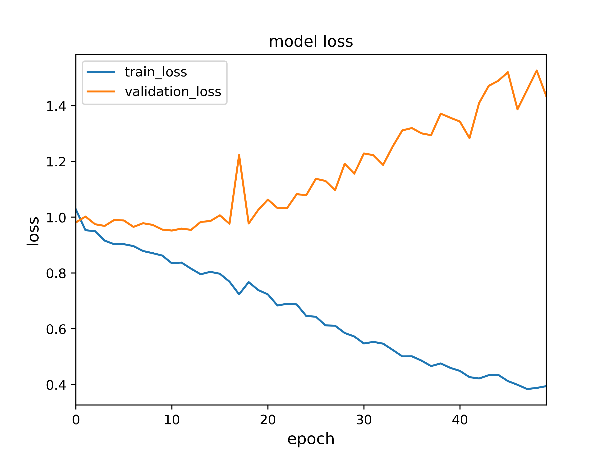

# Classifying-Cervix-Types-Using-CNN

## Objective: Accurately Classify Cervix Types for Diagnosing Cervical Cancer Using Convolutional Neural Networks
 
This project uses convolutional neural networks(CNN) to classify cervix images into three types based on the location of transformation zones. While three CNN models are trained with original cervix images, the fourth CNN model is trained with processed images in which only the region of interest (ROI) is shown and the other irrelevant region becomes black in color. All the CNN models, in regardless of employing image segmentation, reached the similar accuracy of ~60% and sparse categorical cross entropy loss of ~0.9. This indicates all models’ performances are similar. We believe that the quality of the training data might be the bottleneck of improving the model’s performance.

## Selective Key Results

### architecture of CNN models:
------------

  

### Loss and Accuracy of four CNN models:
------------

  
  
  
  
  
   
  
  

